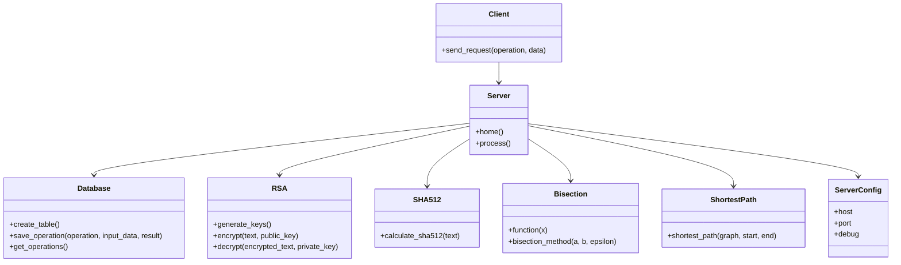

# Class Diagram

Диаграмма классов показывает основные классы проекта и связи между ними.

## Описание классов

- `Client` отправляет запросы на сервер.
- `Server` принимает запросы и возвращает результат.
- `Database` сохраняет историю операций.
- `ServerConfig` реализует шаблон Singleton.
- `RSA` выполняет шифрование и расшифрование.
- `SHA512` вычисляет хэш.
- `Bisection` находит корень уравнения методом деления пополам.
- `ShortestPath` ищет кратчайшее расстояние между вершинами графа.
