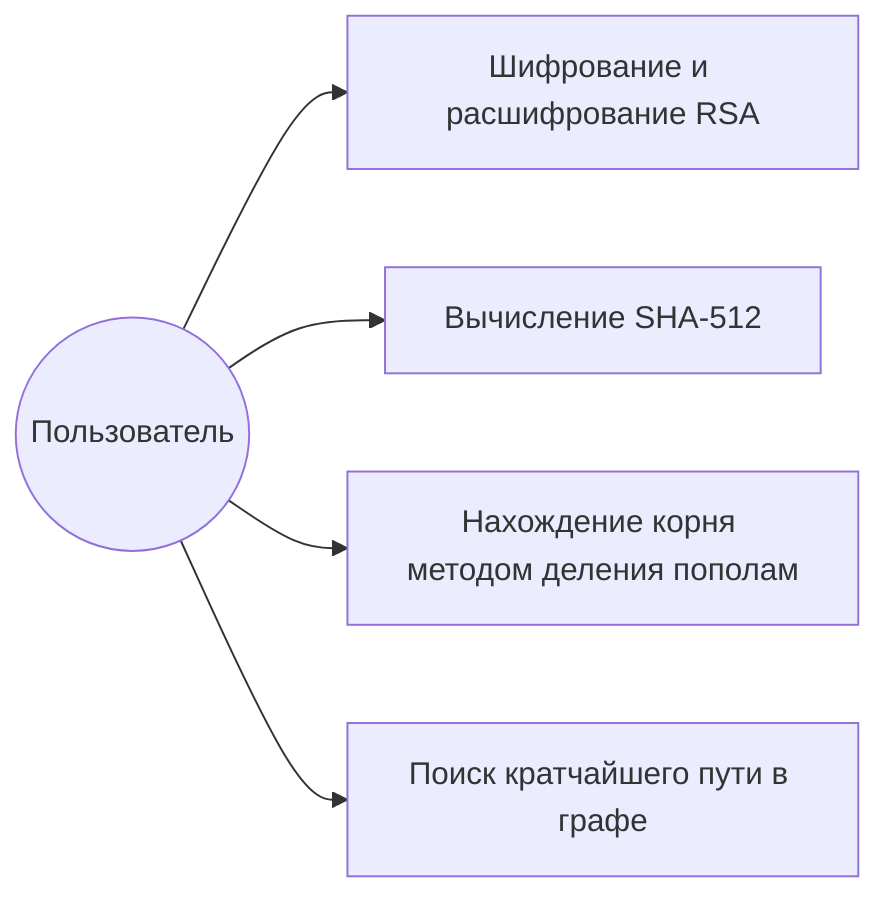

# Use Case Diagram

Диаграмма вариантов использования показывает основные действия пользователя в системе.

## Описание

Пользователь может выбрать одну из функций приложения:

1. выполнить шифрование или расшифрование текста с помощью RSA;
2. вычислить SHA-512 хэш;
3. найти корень уравнения методом деления пополам;
4. найти кратчайшее расстояние между вершинами графа.
